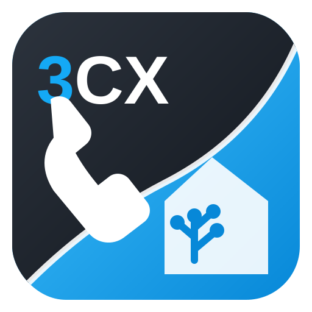

<p align="center">
  
</p>

# 3CX Home Assistant

Private Home Assistant custom integration for connecting a 3CX V20 phone system directly with Home Assistant.

## Project status

Current version: **0.8.2**

The integration combines the official 3CX V20 Configuration API with an isolated Call Control realtime layer. It creates a central PBX device, separate devices for users/extensions and separate devices for queues.

## Installation

The repository is prepared for installation through HACS as a custom repository and for manual installation using the generated `threecx.zip` release package.

See [INSTALLATION.md](INSTALLATION.md) for the complete instructions.

## Current functions

- Client-credentials authentication through `/connect/token`
- Automatic bearer-token renewal
- Multi-source import of users, roles and departments
- One Home Assistant device per user/extension
- Registration and presence status
- Queue devices with member and logged-in-agent sensors
- Build-specific probing of separate queue-agent navigation endpoints
- Queue-agent field and endpoint diagnostics
- Isolated Call Control websocket transport with automatic reconnection
- Normalized Home Assistant events for ringing, dialing, connected, held and ended calls
- Automatic discovery of newly created extensions and queues

## Queue-agent diagnostics

3CX V20 builds expose queue membership through different OData navigation paths. Version 0.8.2 first loads the queue collection without a fragile `$expand` expression and then probes several agent endpoints for every queue.

Open the central entity **Call Control verbunden** and inspect the attribute:

```text
queue_agent_diagnostics
```

For every queue it shows:

```text
endpoint
agent_count
agent_fields
errors
```

This makes it possible to identify the exact endpoint and login-status field returned by the installed 3CX build.

## Home Assistant events

The integration fires the generic event:

```text
threecx_call_control_event
```

and normalized events where possible, for example:

```text
threecx_ringing
threecx_dialing
threecx_connected
threecx_held
threecx_ended
threecx_queue_login
threecx_queue_logout
```

## Automated validation and releases

GitHub Actions validates Python syntax, JSON files and version consistency between `version.txt` and `manifest.json`. Every version update on `main` builds and publishes `threecx.zip`.

## 3CX V20 preparation

Create an API application in the 3CX administration interface under **Integrations → API**. Enable Configuration API access and, for realtime functions, Call Control API access. Save the generated client ID and API key securely.

## Important

This is an unofficial private integration and is not affiliated with 3CX or Home Assistant. The combined project logo is used only to identify this integration; the 3CX and Home Assistant names and marks belong to their respective owners.
